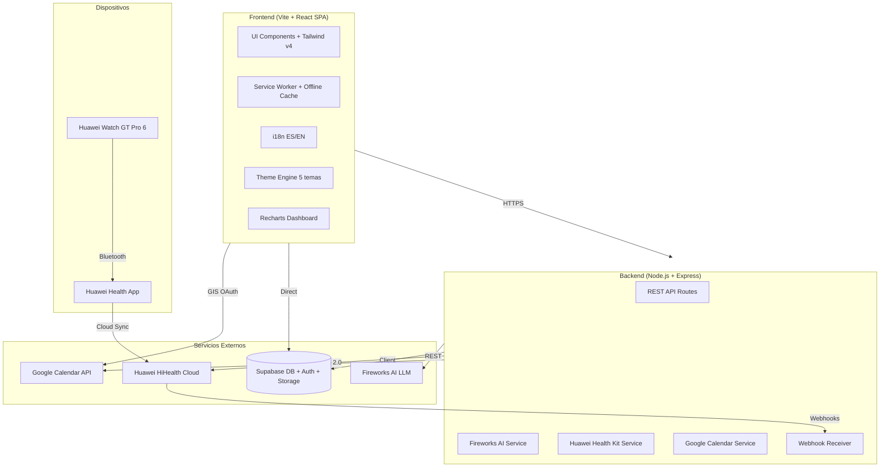

# FitCoach AI — Entrenador Personal Deportivo con IA

Tu entrenador experto en running, fútbol y salud general. Una SPA profesional que analiza datos de tu Huawei Watch GT Pro 6, te da recomendaciones personalizadas con IA, y organiza tus entrenamientos.

---

## Stack Tecnológico

| Capa | Tecnología |
|:---|:---|
| **Frontend** | Vite + React 19 + TypeScript + Tailwind CSS v4 |
| **Backend** | Node.js + Express + TypeScript |
| **Base de datos & Auth** | Supabase (PostgreSQL + Auth + Storage + Realtime) |
| **IA Coach** | Fireworks AI — Llama 3.3 70B Instruct (OpenAI-compatible API) |
| **Datos de salud** | Huawei Health Kit REST API v2 + importación manual (JSON/TCX/GPX) |
| **Calendario** | Google Calendar API v3 (GIS Token Client) |
| **Gráficos** | Recharts (React-native, TypeScript, responsive) |
| **PWA** | Vite PWA Plugin + Workbox |
| **i18n** | react-i18next |
| **Deploy** | Vercel (frontend) + Render (backend, free tier) |

---

## Ubicación del Proyecto

```
C:\Users\LENOVO\Documents\Proyectos\Proff\
├── fitcoach-ai/          # Frontend (Vite + React + TS + Tailwind v4)
└── fitcoach-api/         # Backend (Node.js + Express + TS)
```

---

## Arquitectura General



---

## User Review Required

> [!IMPORTANT]
> **Huawei Health Kit — Proceso de aprobación:** La integración directa con Huawei Health Kit REST API requiere **cuenta de desarrollador Enterprise** en AppGallery Connect. El proceso de aprobación de scopes toma **~15 días hábiles**. Mientras tanto, en **Fase 2** implementaremos importación manual de datos (export JSON/TCX/GPX desde la app Huawei Health), y en **Fase 4** la integración directa una vez aprobada la cuenta.

> [!IMPORTANT]
> **Fireworks AI — Créditos:** El free tier da **$1 USD en créditos** (~1-10M tokens con Llama 3.3 70B). Suficiente para desarrollo y testing extensivo. Para producción continua, necesitarás recargar créditos (~$0.90/1M tokens para 70B).

> [!WARNING]
> **Google Calendar API — Verificación:** El scope `calendar.events` es "Sensitive". En modo Testing soporta hasta 100 usuarios de prueba sin verificación de Google. Para producción pública se necesita verificar el OAuth consent screen (privacy policy + video demo).

---

## 📋 Pasos Manuales del Usuario (lo que TÚ debes hacer)

Todo lo que yo **no puedo hacer por ti** porque requiere tu navegador, tus credenciales o tus cuentas personales. Organizado por fase para que hagas solo lo necesario en cada etapa.

---

### 🟢 ANTES DE FASE 1 (hacer AHORA)

#### Paso 1: Crear proyecto en Supabase
1. Ir a [https://supabase.com](https://supabase.com) → **Start your project** (gratis con GitHub login)
2. Click **New Project**
3. Configurar:
   - **Name:** `fitcoach-ai`
   - **Database Password:** genera una segura y guárdala
   - **Region:** el más cercano a ti (ej: `South America (São Paulo)`)
4. Esperar ~2 min a que se cree
5. Ir a **Settings → API** y copiar:
   - ✅ `Project URL` → (ejemplo: `https://xxxxx.supabase.co`)
   - ✅ `anon public key` → (empieza con `eyJ...`)
   - ✅ `service_role key` → (empieza con `eyJ...`, **NUNCA exponer en frontend**)
6. **Darme estos 3 valores** para configurar las variables de entorno

#### Paso 2: Configurar Auth providers en Supabase
1. En Supabase Dashboard → **Authentication → Providers**
2. **Email:** ya viene habilitado por defecto ✅
3. **Google OAuth:**
   - Ir a [Google Cloud Console](https://console.cloud.google.com/) → Crear nuevo proyecto (ej: `FitCoach AI`)
   - **APIs & Services → OAuth consent screen** → External → llenar nombre app + tu email
   - **APIs & Services → Credentials** → **Create Credentials → OAuth client ID**
   - Application type: **Web application**
   - Authorized redirect URIs: agregar `https://xxxxx.supabase.co/auth/v1/callback` (reemplazar xxx con tu Project URL)
   - Copiar **Client ID** y **Client Secret**
   - Volver a Supabase → **Providers → Google** → activar → pegar Client ID y Secret
4. **Magic Link:** ya viene habilitado por defecto con Email ✅

#### Paso 3: Darme los valores
Una vez tengas todo, pásame:
```
SUPABASE_URL=https://xxxxx.supabase.co
SUPABASE_ANON_KEY=eyJ...
SUPABASE_SERVICE_KEY=eyJ...
GOOGLE_CLIENT_ID=xxxxx.apps.googleusercontent.com
```
> [!CAUTION]
> **No compartas el `SUPABASE_SERVICE_KEY` públicamente.** Solo se usa en el backend server-side.

---

### 🟡 ANTES DE FASE 3 (hacer cuando lleguemos)

#### Paso 4: Crear cuenta en Fireworks AI
1. Ir a [https://fireworks.ai](https://fireworks.ai) → **Sign Up** (con Google o GitHub)
2. Recibes **$1 USD en créditos gratis** automáticamente
3. Ir a **Settings → API Keys** → **Create API Key**
4. Copiar la key (empieza con `fw_...`)
5. **Darme el valor:**
```
FIREWORKS_API_KEY=fw_...
```

---

### 🟠 ANTES DE FASE 4 (hacer cuando lleguemos, idealmente empezar en Fase 1)

#### Paso 5: Crear cuenta de desarrollador Huawei (EMPEZAR PRONTO — toma ~15 días)
1. Ir a [https://developer.huawei.com](https://developer.huawei.com/consumer/en/) → registrar HUAWEI ID
2. **Developer Center → Identity Verification** → elegir **Enterprise** (recomendado) o **Individual**
   - Enterprise requiere: registro de empresa, ID legal, etc.
   - Individual es más fácil pero con límite de 100 usuarios test
3. Ir a **AppGallery Connect** → crear **Proyecto** → agregar **Web Application**
4. Buscar **Health Service Kit** → **Apply for Health Service Kit**
5. Seleccionar scopes: `step.read`, `heartrate.read`, `sleep.read`, `activityrecord.read`, `spo2.read`, `stress.read`
6. Llenar: descripción del producto, mockups, URL de privacy policy, justificación de cada métrica
7. Esperar aprobación (~15 días hábiles)
8. Una vez aprobado, copiar **Client ID (App ID)** y **Client Secret (App Secret)**
9. **Darme los valores:**
```
HUAWEI_CLIENT_ID=...
HUAWEI_CLIENT_SECRET=...
```

> [!TIP]
> **Recomendación:** Empieza el Paso 5 ahora mismo en paralelo. Así cuando lleguemos a Fase 4, ya tendrás la aprobación. Las primeras 3 fases no dependen de esto.

#### Paso 6: Habilitar Google Calendar API
1. En tu proyecto de Google Cloud Console (el mismo del Paso 2)
2. **APIs & Services → Library** → buscar `Google Calendar API` → **Enable**
3. En **Credentials** → el mismo OAuth Client ID del Paso 2, agregar:
   - **Authorized JavaScript origins:** `http://localhost:5173` y tu dominio de producción
4. En **OAuth consent screen → Scopes** → agregar `https://www.googleapis.com/auth/calendar.events`
5. En **Test users** → agregar tu email de Gmail
6. No necesitas darme nada extra, usa el mismo `GOOGLE_CLIENT_ID` del Paso 2

---

### 🔴 ANTES DE FASE 6 (hacer cuando lleguemos)

#### Paso 7: Crear cuenta en Render (backend hosting)
1. Ir a [https://render.com](https://render.com) → Sign up con GitHub
2. Conectar tu repositorio de GitHub
3. Crear **New → Web Service** → seleccionar el repo del backend
4. Configurar variables de entorno en Render Dashboard
5. Te guiaré en detalle cuando lleguemos a esta fase

#### Paso 8: Configurar Vercel (frontend hosting)
1. Ir a [https://vercel.com](https://vercel.com) → Sign up con GitHub
2. Importar el repositorio del frontend
3. Configurar variables de entorno
4. Te guiaré en detalle cuando lleguemos a esta fase

---

### Resumen de acciones por fase

| Fase | Tus pasos | Qué necesito de ti |
|:---|:---|:---|
| **Fase 1** | Pasos 1, 2, 3 (Supabase + Google OAuth) | URLs y API keys |
| **Fase 2** | Ninguno | Exportar un archivo de prueba desde Huawei Health |
| **Fase 3** | Paso 4 (Fireworks AI) | API key |
| **Fase 4** | Pasos 5, 6 (Huawei Dev + Google Calendar) | Client IDs y Secrets |
| **Fase 5** | Ninguno | Probar instalación PWA en tu Redmi |
| **Fase 6** | Pasos 7, 8 (Render + Vercel) | Conectar repos |

---

## Fases de Implementación

---

### 📦 FASE 1 — Fundación (Setup, Auth, Temas, i18n, Layout)

La base sobre la que se construye todo. Al final de esta fase tendrás una app instalable con login funcional, sistema de temas y navegación completa.

#### [NEW] Proyecto frontend: `fitcoach-ai/`

```
fitcoach-ai/
├── src/
│   ├── main.tsx                    # Entry point
│   ├── App.tsx                     # Router + providers
│   ├── index.css                   # Tailwind v4 @theme tokens + base styles
│   ├── config/
│   │   └── supabase.ts             # Supabase client init
│   ├── i18n/
│   │   ├── index.ts                # i18next config
│   │   ├── es.json                 # Traducciones español
│   │   └── en.json                 # Traducciones inglés
│   ├── hooks/
│   │   ├── useAuth.ts              # Auth state hook
│   │   ├── useTheme.ts             # Theme management hook
│   │   └── useLanguage.ts          # Language switcher hook
│   ├── contexts/
│   │   ├── AuthContext.tsx          # Auth provider
│   │   └── ThemeContext.tsx         # Theme provider
│   ├── components/
│   │   ├── layout/
│   │   │   ├── AppShell.tsx         # Main layout wrapper
│   │   │   ├── Sidebar.tsx          # Navigation sidebar (desktop)
│   │   │   ├── BottomNav.tsx        # Bottom navigation (mobile)
│   │   │   ├── Header.tsx           # Top bar con avatar, theme toggle, lang
│   │   │   └── PageTransition.tsx   # Route transition animations
│   │   ├── auth/
│   │   │   ├── LoginPage.tsx        # Login form (email, Google, Magic Link)
│   │   │   ├── SignupPage.tsx       # Registration
│   │   │   └── ProtectedRoute.tsx   # Auth guard
│   │   └── ui/
│   │       ├── Button.tsx           # Base button component
│   │       ├── Card.tsx             # Styled card
│   │       ├── Input.tsx            # Form input
│   │       ├── Modal.tsx            # Dialog/modal
│   │       ├── Spinner.tsx          # Loading spinner
│   │       └── ThemeSwitcher.tsx    # Theme selector dropdown
│   └── pages/
│       ├── Dashboard.tsx            # Placeholder → Fase 2
│       ├── Chat.tsx                 # Placeholder → Fase 3
│       ├── History.tsx              # Placeholder → Fase 2
│       ├── Calendar.tsx             # Placeholder → Fase 4
│       ├── Profile.tsx              # User profile + settings
│       └── NotFound.tsx             # 404
├── public/
│   ├── manifest.json               # PWA manifest
│   ├── icons/                      # App icons (192, 512)
│   └── sw.js                       # Service worker placeholder
├── .env.local                      # Environment variables
├── vite.config.ts                  # Vite config + PWA plugin
├── tailwind.config.ts              # Tailwind v4 config (minimal, @theme based)
├── tsconfig.json
└── package.json
```

**Sistema de 5 temas con CSS custom properties + Tailwind v4 `@theme`:**

| Tema | Nombre | Background | Surface | Accent | Text |
|:---|:---|:---|:---|:---|:---|
| 🖤 AMOLED | `amoled` | `#000000` | `#0a0a0a` | `#22d3ee` (cyan) | `#fafafa` |
| 🌑 Dark Gray | `dark` | `#111113` | `#1a1a1e` | `#60a5fa` (blue) | `#e5e5e5` |
| 🌙 Night Blue | `night` | `#0b1120` | `#111827` | `#818cf8` (indigo) | `#e0e7ff` |
| 🌲 Forest | `forest` | `#0a1a0f` | `#0f2518` | `#34d399` (emerald) | `#d1fae5` |
| ☀️ Light | `light` | `#f8f9fa` | `#ffffff` | `#2563eb` (blue) | `#1f2937` |

**Auth con Supabase:** Email/Password + Google OAuth + Magic Link. El usuario elige al registrarse.

---

#### [NEW] Proyecto backend: `fitcoach-api/`

```
fitcoach-api/
├── src/
│   ├── index.ts                    # Express server entry
│   ├── config/
│   │   ├── env.ts                  # Environment validation
│   │   └── supabase.ts             # Supabase admin client
│   ├── middleware/
│   │   ├── auth.ts                 # JWT verification (Supabase JWT)
│   │   ├── rateLimit.ts            # Rate limiting
│   │   └── errorHandler.ts         # Global error handler
│   ├── routes/
│   │   ├── health.ts               # Health check
│   │   ├── ai.ts                   # AI coach endpoints → Fase 3
│   │   ├── huaweiHealth.ts         # Huawei data endpoints → Fase 4
│   │   ├── calendar.ts             # Google Calendar proxy → Fase 4
│   │   └── sessions.ts             # Training sessions CRUD
│   ├── services/
│   │   ├── fireworks.ts            # Fireworks AI client → Fase 3
│   │   ├── huaweiHealth.ts         # Huawei Health Kit service → Fase 4
│   │   └── analysis.ts             # Data analysis/processing → Fase 3
│   └── types/
│       └── index.ts                # Shared types
├── .env                            # Server env vars
├── tsconfig.json
└── package.json
```

---

#### Supabase Database Schema (Fase 1)

```sql
-- Users profile (extends Supabase auth.users)
CREATE TABLE public.profiles (
    id UUID REFERENCES auth.users(id) PRIMARY KEY,
    display_name TEXT,
    avatar_url TEXT,
    preferred_language TEXT DEFAULT 'es' CHECK (preferred_language IN ('es', 'en')),
    preferred_theme TEXT DEFAULT 'dark' CHECK (preferred_theme IN ('amoled', 'dark', 'night', 'forest', 'light')),
    timezone TEXT DEFAULT 'America/Caracas',
    sport_focus TEXT[] DEFAULT ARRAY['running', 'football'],
    fitness_level TEXT DEFAULT 'intermediate' CHECK (fitness_level IN ('beginner', 'intermediate', 'advanced', 'elite')),
    height_cm NUMERIC,
    weight_kg NUMERIC,
    birth_date DATE,
    created_at TIMESTAMPTZ DEFAULT now(),
    updated_at TIMESTAMPTZ DEFAULT now()
);

-- RLS policies
ALTER TABLE public.profiles ENABLE ROW LEVEL SECURITY;
CREATE POLICY "Users can read own profile" ON public.profiles FOR SELECT USING (auth.uid() = id);
CREATE POLICY "Users can update own profile" ON public.profiles FOR UPDATE USING (auth.uid() = id);
CREATE POLICY "Users can insert own profile" ON public.profiles FOR INSERT WITH CHECK (auth.uid() = id);

-- Auto-create profile on signup
CREATE OR REPLACE FUNCTION public.handle_new_user()
RETURNS TRIGGER AS $$
BEGIN
    INSERT INTO public.profiles (id, display_name, avatar_url)
    VALUES (NEW.id, NEW.raw_user_meta_data->>'full_name', NEW.raw_user_meta_data->>'avatar_url');
    RETURN NEW;
END;
$$ LANGUAGE plpgsql SECURITY DEFINER;

CREATE TRIGGER on_auth_user_created
    AFTER INSERT ON auth.users
    FOR EACH ROW EXECUTE FUNCTION public.handle_new_user();
```

---

### 📊 FASE 2 — Dashboard, Data Import & Visualización

Dashboard estilo Strava/Garmin con importación manual de datos del reloj.

#### [NEW] Componentes de datos y dashboard

```
src/
├── components/
│   ├── dashboard/
│   │   ├── DashboardPage.tsx        # Main dashboard layout
│   │   ├── StatsOverview.tsx        # Today's summary cards (steps, HR, calories, distance)
│   │   ├── WeeklyChart.tsx          # 7-day activity bar chart
│   │   ├── HeartRateZones.tsx       # HR zone distribution (donut chart)
│   │   ├── SleepChart.tsx           # Sleep stages stacked bar
│   │   ├── RunningPaceChart.tsx     # Pace over distance line chart
│   │   ├── ProgressTimeline.tsx     # Month-over-month progress
│   │   ├── ActivityHeatmap.tsx      # GitHub-style activity heatmap
│   │   └── RecentSessions.tsx       # Latest workout cards
│   ├── sessions/
│   │   ├── SessionList.tsx          # All sessions with filters
│   │   ├── SessionDetail.tsx        # Individual session deep dive
│   │   ├── SessionComparison.tsx    # Side-by-side session compare
│   │   └── RunningMetrics.tsx       # Pace, cadence, VO2max, elevation
│   ├── import/
│   │   ├── DataImport.tsx           # Import wizard modal
│   │   ├── FileUploader.tsx         # Drag & drop TCX/GPX/JSON files
│   │   ├── ImportPreview.tsx        # Preview parsed data before saving
│   │   └── parsers/
│   │       ├── tcxParser.ts         # Parse TCX (Garmin/Huawei export)
│   │       ├── gpxParser.ts         # Parse GPX (GPS tracks)
│   │       └── huaweiJsonParser.ts  # Parse Huawei Health JSON export
│   └── charts/
│       ├── LineChart.tsx            # Reusable line chart wrapper
│       ├── BarChart.tsx             # Reusable bar chart wrapper
│       ├── DonutChart.tsx           # Reusable donut/pie
│       ├── AreaChart.tsx            # Reusable area chart
│       └── ChartTooltip.tsx         # Custom styled tooltip
```

#### Supabase Schema (Fase 2)

```sql
-- Training sessions
CREATE TABLE public.training_sessions (
    id UUID DEFAULT gen_random_uuid() PRIMARY KEY,
    user_id UUID REFERENCES public.profiles(id) NOT NULL,
    sport_type TEXT NOT NULL CHECK (sport_type IN ('running', 'football', 'walking', 'cycling', 'gym', 'other')),
    title TEXT,
    description TEXT,
    started_at TIMESTAMPTZ NOT NULL,
    ended_at TIMESTAMPTZ,
    duration_seconds INTEGER,
    distance_meters NUMERIC,
    calories_burned NUMERIC,
    avg_heart_rate INTEGER,
    max_heart_rate INTEGER,
    avg_pace_sec_per_km NUMERIC,
    max_speed_kmh NUMERIC,
    cadence_avg INTEGER,
    vo2max_estimate NUMERIC,
    elevation_gain_m NUMERIC,
    steps INTEGER,
    source TEXT DEFAULT 'manual' CHECK (source IN ('manual', 'huawei_import', 'huawei_api', 'manual_input')),
    raw_data JSONB,                   -- Full imported data blob
    gps_track JSONB,                  -- Array of {lat, lng, alt, timestamp}
    heart_rate_samples JSONB,         -- Array of {timestamp, bpm}
    ai_analysis JSONB,                -- AI coach analysis results → Fase 3
    created_at TIMESTAMPTZ DEFAULT now()
);

-- Daily health metrics (aggregated)
CREATE TABLE public.daily_metrics (
    id UUID DEFAULT gen_random_uuid() PRIMARY KEY,
    user_id UUID REFERENCES public.profiles(id) NOT NULL,
    date DATE NOT NULL,
    steps INTEGER,
    calories_total NUMERIC,
    calories_active NUMERIC,
    distance_meters NUMERIC,
    resting_heart_rate INTEGER,
    avg_heart_rate INTEGER,
    max_heart_rate INTEGER,
    spo2_avg NUMERIC,
    stress_avg INTEGER,
    sleep_duration_minutes INTEGER,
    sleep_deep_minutes INTEGER,
    sleep_light_minutes INTEGER,
    sleep_rem_minutes INTEGER,
    sleep_awake_minutes INTEGER,
    sleep_score INTEGER,
    weight_kg NUMERIC,
    source TEXT DEFAULT 'manual',
    created_at TIMESTAMPTZ DEFAULT now(),
    UNIQUE (user_id, date)
);

-- RLS
ALTER TABLE public.training_sessions ENABLE ROW LEVEL SECURITY;
ALTER TABLE public.daily_metrics ENABLE ROW LEVEL SECURITY;
CREATE POLICY "Users own sessions" ON public.training_sessions FOR ALL USING (auth.uid() = user_id);
CREATE POLICY "Users own metrics" ON public.daily_metrics FOR ALL USING (auth.uid() = user_id);

-- Indexes
CREATE INDEX idx_sessions_user_date ON public.training_sessions (user_id, started_at DESC);
CREATE INDEX idx_metrics_user_date ON public.daily_metrics (user_id, date DESC);
```

---

### 🤖 FASE 3 — AI Coach (Fireworks AI + Chat + Análisis)

El cerebro de la app. Chat libre con el coach, análisis post-sesión, planes de entrenamiento, y recomendaciones.

#### [NEW] Componentes AI

```
src/
├── components/
│   ├── chat/
│   │   ├── ChatPage.tsx             # Full chat interface
│   │   ├── ChatMessage.tsx          # Individual message bubble
│   │   ├── ChatInput.tsx            # Input with voice/text + context menu
│   │   ├── ChatSuggestions.tsx      # Quick action chips
│   │   └── TrainingInputNL.tsx      # Natural language training entry
│   ├── analysis/
│   │   ├── PostSessionAnalysis.tsx  # AI analysis after workout
│   │   ├── WeeklyReport.tsx         # Weekly AI-generated summary
│   │   ├── PerformancePrediction.tsx # Predicted race times, trend
│   │   ├── ImprovementTips.tsx      # Personalized improvement cards
│   │   └── CompareAnalysis.tsx      # AI comparison between sessions
│   └── training/
│       ├── TrainingPlan.tsx          # AI-generated weekly plan
│       ├── PlanEditor.tsx           # Edit/adjust plan
│       └── NaturalLanguageInput.tsx # "Hoy corrí 5km en 28 min" → parsed session
```

#### Backend AI Service

```
fitcoach-api/src/
├── services/
│   ├── fireworks.ts                 # Fireworks AI client wrapper
│   │   - createChatCompletion()     # General chat with coach context
│   │   - analyzeSession()           # Post-session structured analysis
│   │   - generateTrainingPlan()     # Weekly plan generation
│   │   - parseNaturalLanguage()     # NL → structured session data
│   │   - predictPerformance()       # Trend analysis + predictions
│   └── prompts/
│       ├── systemPrompt.ts          # Base coach personality & expertise
│       ├── sessionAnalysis.ts       # Session analysis prompt template
│       ├── trainingPlan.ts          # Plan generation prompt template
│       ├── nlParser.ts              # Natural language parser prompt
│       └── weeklyReport.ts          # Weekly summary prompt
```

**Modelo de IA seleccionado:**
- **Chat general + análisis:** `llama-v3p3-70b-instruct` — Mejor razonamiento, entiende contexto deportivo complejo
- **Parseo NL rápido:** `llama-v3p1-8b-instruct` — Rápido para extraer datos estructurados de texto natural
- **Structured output:** `response_format: { type: "json_schema" }` para garantizar respuestas parseables

**System Prompt del Coach (concepto):**
```
Eres FitCoach AI, un entrenador personal experto certificado en running y fútbol.
Tu enfoque es personalizado, motivador pero realista, basado en datos del usuario.
Analizas métricas de frecuencia cardíaca, pace, cadencia, VO2max, sueño y estrés.
Respondes en el idioma del usuario (es/en). Siempre das recomendaciones accionables.
Conoces periodización, zonas de entrenamiento (Maffetone, 80/20), prevención de lesiones,
nutrición deportiva básica, y preparación específica para carreras y partidos de fútbol.
```

#### Supabase Schema (Fase 3)

```sql
-- Chat conversations
CREATE TABLE public.chat_conversations (
    id UUID DEFAULT gen_random_uuid() PRIMARY KEY,
    user_id UUID REFERENCES public.profiles(id) NOT NULL,
    title TEXT,
    created_at TIMESTAMPTZ DEFAULT now(),
    updated_at TIMESTAMPTZ DEFAULT now()
);

-- Chat messages
CREATE TABLE public.chat_messages (
    id UUID DEFAULT gen_random_uuid() PRIMARY KEY,
    conversation_id UUID REFERENCES public.chat_conversations(id) ON DELETE CASCADE,
    role TEXT NOT NULL CHECK (role IN ('user', 'assistant', 'system')),
    content TEXT NOT NULL,
    metadata JSONB,  -- referenced session IDs, analysis results, etc.
    created_at TIMESTAMPTZ DEFAULT now()
);

-- Training plans
CREATE TABLE public.training_plans (
    id UUID DEFAULT gen_random_uuid() PRIMARY KEY,
    user_id UUID REFERENCES public.profiles(id) NOT NULL,
    title TEXT NOT NULL,
    sport_type TEXT NOT NULL,
    start_date DATE NOT NULL,
    end_date DATE NOT NULL,
    plan_data JSONB NOT NULL,  -- Structured weekly plan
    ai_generated BOOLEAN DEFAULT true,
    status TEXT DEFAULT 'active' CHECK (status IN ('active', 'completed', 'paused', 'cancelled')),
    created_at TIMESTAMPTZ DEFAULT now()
);

-- RLS
ALTER TABLE public.chat_conversations ENABLE ROW LEVEL SECURITY;
ALTER TABLE public.chat_messages ENABLE ROW LEVEL SECURITY;
ALTER TABLE public.training_plans ENABLE ROW LEVEL SECURITY;
CREATE POLICY "Users own conversations" ON public.chat_conversations FOR ALL USING (auth.uid() = user_id);
CREATE POLICY "Users own messages" ON public.chat_messages FOR ALL
    USING (EXISTS (SELECT 1 FROM public.chat_conversations c WHERE c.id = conversation_id AND c.user_id = auth.uid()));
CREATE POLICY "Users own plans" ON public.training_plans FOR ALL USING (auth.uid() = user_id);
```

---

### 🔗 FASE 4 — Integraciones Externas (Huawei Health Kit + Google Calendar)

Conexión directa con Huawei Cloud y sincronización con Google Calendar.

#### Huawei Health Kit Integration

```
fitcoach-api/src/
├── services/
│   └── huaweiHealth.ts
│       - initiateOAuth()            # Redirect to Huawei consent screen
│       - handleCallback()           # Exchange code for tokens
│       - refreshToken()             # Auto-refresh expired tokens
│       - fetchActivityRecords()     # Pull workout sessions
│       - fetchSampleSets()          # Pull HR, steps, SpO2, stress
│       - fetchSleepRecords()        # Pull sleep data
│       - registerWebhook()          # Subscribe to push notifications
│       - handleWebhookEvent()       # Process incoming data events
```

**OAuth flow:** Authorization Code Grant con `access_type=offline` para refresh tokens. Tokens almacenados encriptados en Supabase.

**Scopes solicitados:**
- `healthkit/step.read` — Pasos
- `healthkit/heartrate.read` — Frecuencia cardíaca
- `healthkit/sleep.read` — Sueño
- `healthkit/activityrecord.read` — Sesiones de entrenamiento
- `healthkit/spo2.read` — SpO2
- `healthkit/stress.read` — Estrés

#### Google Calendar Integration (Client-Side GIS)

```
src/
├── hooks/
│   └── useGoogleCalendar.ts         # GIS Token Client hook
├── components/
│   └── calendar/
│       ├── CalendarPage.tsx          # Calendar view with training plan
│       ├── AddToCalendar.tsx         # Button to sync session/plan to GCal
│       └── CalendarSync.tsx          # Bulk sync training plan to calendar
```

**Approach:** Client-side GIS Token Client (no backend needed). Access token obtenido on-demand con popup, evento creado directamente desde el browser via `fetch()` a Google Calendar API.

#### Supabase Schema (Fase 4)

```sql
-- Huawei OAuth tokens (encrypted)
CREATE TABLE public.huawei_connections (
    id UUID DEFAULT gen_random_uuid() PRIMARY KEY,
    user_id UUID REFERENCES public.profiles(id) UNIQUE NOT NULL,
    access_token_encrypted TEXT NOT NULL,
    refresh_token_encrypted TEXT NOT NULL,
    token_expires_at TIMESTAMPTZ NOT NULL,
    scopes TEXT[] NOT NULL,
    huawei_user_id TEXT,
    last_sync_at TIMESTAMPTZ,
    sync_status TEXT DEFAULT 'active',
    created_at TIMESTAMPTZ DEFAULT now()
);

ALTER TABLE public.huawei_connections ENABLE ROW LEVEL SECURITY;
CREATE POLICY "Users own connection" ON public.huawei_connections FOR ALL USING (auth.uid() = user_id);
```

---

### 📱 FASE 5 — PWA Completa, Offline & Notificaciones Push

Convertir la app en una PWA completa instalable con soporte offline y notificaciones.

#### PWA Features

```
src/
├── sw/
│   ├── serviceWorker.ts             # Custom service worker
│   ├── cacheStrategies.ts           # Cache-first for assets, network-first for API
│   └── pushHandler.ts               # Push notification handler
├── components/
│   ├── pwa/
│   │   ├── InstallPrompt.tsx        # "Add to Home Screen" prompt
│   │   ├── OfflineBanner.tsx        # Offline status indicator
│   │   └── UpdateNotification.tsx   # New version available toast
│   └── notifications/
│       ├── NotificationSettings.tsx # Push notification preferences
│       └── notificationService.ts   # Subscribe/unsubscribe to push
```

**Estrategia de cache:**
- **Cache-first:** Assets estáticos (JS, CSS, fuentes, imágenes)
- **Stale-while-revalidate:** Dashboard data, métricas recientes
- **Network-first:** Chat AI, datos en tiempo real
- **Offline fallback:** Página offline con datos cacheados del último dashboard

**Push notifications:**
- Recordatorio de entrenamiento según el plan
- Resumen semanal disponible
- "No has entrenado en 3 días" — motivación
- Nuevo análisis AI disponible tras sync de datos

---

### 🚀 FASE 6 — Deploy a Producción

#### Frontend → Vercel (Free Tier)

- Build: `npm run build` (Vite → static assets)
- Deploy: Conectar repositorio GitHub → auto-deploy en push a `main`
- Configurar dominio personalizado (si existe) o usar `fitcoach-ai.vercel.app`
- Environment variables: `VITE_SUPABASE_URL`, `VITE_SUPABASE_ANON_KEY`, `VITE_GOOGLE_CLIENT_ID`

#### Backend → Render (Free Tier)

- Runtime: Node.js
- Build: `npm run build` (tsc → dist/)
- Start: `node dist/index.js`
- Environment variables: `SUPABASE_URL`, `SUPABASE_SERVICE_KEY`, `FIREWORKS_API_KEY`, `HUAWEI_CLIENT_ID`, `HUAWEI_CLIENT_SECRET`
- **Nota:** El free tier de Render tiene cold starts (~30s). Configurar health check endpoint para mantener activo.

#### Supabase (Free Tier)

- 500MB database
- 1GB storage
- 50k monthly active users
- 2M Edge Function invocations

---

## Resumen de Dependencias por Fase

| Fase | Dependencias Frontend | Dependencias Backend |
|:---|:---|:---|
| **1** | `react`, `react-dom`, `react-router-dom`, `@supabase/supabase-js`, `react-i18next`, `i18next`, `lucide-react` | `express`, `cors`, `helmet`, `@supabase/supabase-js`, `dotenv`, `zod` |
| **2** | `recharts`, `date-fns`, `fast-xml-parser` (TCX/GPX parsing) | — |
| **3** | `react-markdown`, `react-textarea-autosize` | `openai` (OpenAI-compatible client for Fireworks) |
| **4** | — | `jsonwebtoken` (Huawei token management) |
| **5** | `vite-plugin-pwa`, `workbox-*` | `web-push` |
| **6** | — | — |

---

## Verification Plan

### Automated Tests
```bash
# Frontend
npm run lint          # ESLint + TypeScript check
npm run build         # Verify production build succeeds
npm run preview       # Preview production build locally

# Backend
npm run lint
npm run build
npm test              # Jest unit tests for AI service, parsers
```

### Manual Verification
- **Fase 1:** Login/logout con email, Google y Magic Link. Cambiar tema y verificar los 5. Cambiar idioma ES↔EN. Responsive en móvil.
- **Fase 2:** Importar archivo TCX/GPX de Huawei Health. Verificar gráficos del dashboard con datos reales.
- **Fase 3:** Chat con el coach AI. Ingresar sesión en lenguaje natural. Verificar análisis post-sesión.
- **Fase 4:** Conectar cuenta Huawei. Verificar sync de datos. Agregar entrenamiento a Google Calendar.
- **Fase 5:** Instalar PWA en Android. Verificar offline. Recibir push notification.
- **Fase 6:** Deploy exitoso. Verificar todo el flujo en producción.
